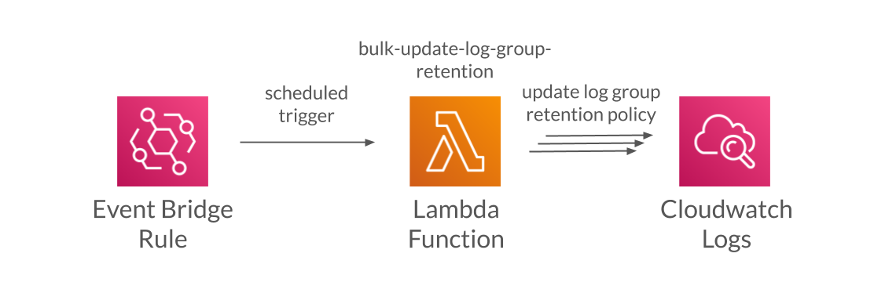

# Bulk Update Log Group Retention

Ensure cloudwatch log events are not retained forever by ensuring all log groups expire log events.

A small serverless app consisting of a single lambda function triggered periodically on a schedule using an Event Bridge rule. The lambda function inspects all log groups in all regions within a single AWS account and updates the retention setting for log groups that are set to never expire log events to a configurable number of days so that log events are never retained forever.



## Environment Variable Configuration

RETENTION_IN_DAYS - The number of days to retain log events for. Log groups without a retention setting will be updated to use the specified value. If not set, 7 days is used. Valid values are 1, 3, 5, 7, 14, 30, 60, 90, 120, 150, 180, 365, 400, 545, 731, 1827, and 3653.

## Usage

1. Install Serverless - https://www.serverless.com/framework/docs/providers/aws/guide/installation/
2. Set up AWS credentials - https://www.serverless.com/framework/docs/providers/aws/guide/credentials/
3. Deploy the app - ```sls deploy```
